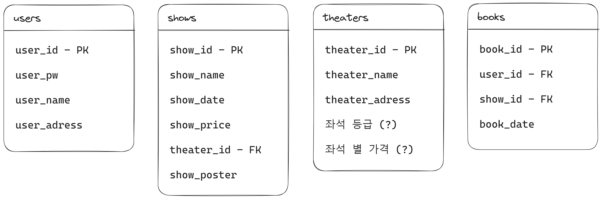

<<<<<<< HEAD
# [프로젝트] React - Spring Boot 상품 관리, 주문관리 API 구현
## 프로젝트 소개 😎
React로 만들어진 Front End가 정해져있는 상황에서,
백엔드 개발자가 Spring Boot로 상품관리 API를 구현하여 A-Z 최종 서비스를 완성시켜봅니다.
클로닝 외에도 "본인만의 아이디어"를 추가하여 더 발전시켜 완성해봅니다. 

## 이곳은 공개 Repo입니다.
1. 이 repo를 fork한 뒤
2. 여러분의 개인 Repo에서 상품관리 API를 A-Z까지 작업하여 
3. 개발이 끝나면 이 Repo에 PR을 보내어 제출을 완료해주세요.
=======
# react-springboot-rest-api

# 주제 : 인터파크 티켓

## 1. 전체 요구 사항 분석

- 회원 가입
- 로그인
- 공연 조회
- 공연 예매 (좌석 선택 → 예매자 및 배송 정보 확인 → 결제하기)
- 마이 페이지

## 2. 도메인 분리

- 회원 (users)
- 공연 (shows)
- 공연장 (theater)
- 예매 (books)

## 3. 도메인 상세

### A. REST API

| Name      | Method | API Path        |
| --------- | ----   | ----------------|
| 회원 가입 | POST | /api/users/signup |
| 로그인    | POST | /api/users/signin |
|/          |      |                   |
| 공연 등록 | POST | /api/shows        |
| 공연 조회 | GET  | /api/shows/{id}   |
|/          |      |                   |
| 예매      | POST | /api/book         |

### B. DB 설계

### C. 클래스 다이어그램

???
>>>>>>> dev
